# 業務フロー設計書

## 📋 1. 概要

このドキュメントでは、みつまるケアシステムの各機能における業務フローと処理の流れについて詳細に説明します。

### 1.1 設計方針

- **業務の自然な流れ**を反映したフロー設計
- **ユーザーの操作感**を重視した処理順序
- **エラーハンドリング**を含む包括的なフロー
- **データの整合性**を保つ処理の順序

### 1.2 フローの分類

1. **認証・認可フロー** - ログインから権限確認まで
2. **シフト管理フロー** - シフト作成から確定まで
3. **役割表管理フロー** - 役割割り当てから確定まで
4. **勤怠管理フロー** - 出退勤から承認まで
5. **マスターデータ管理フロー** - 各種設定データの管理

## 🔐 2. 認証・認可フロー

### 2.1 ログインフロー

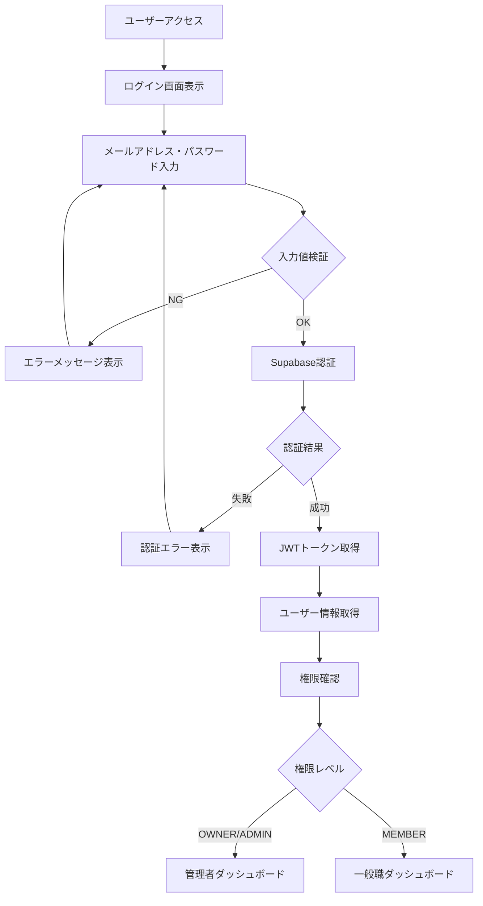

### 2.2 権限チェックフロー

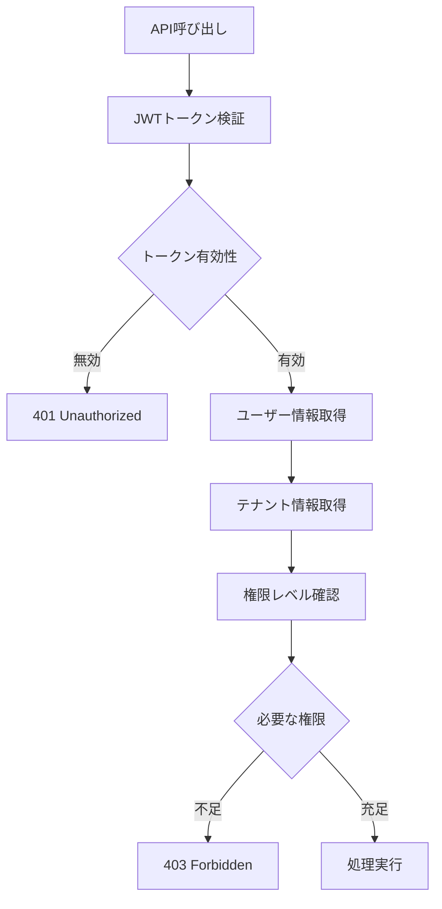

## 📅 3. シフト管理フロー

### 3.1 月間シフト作成フロー

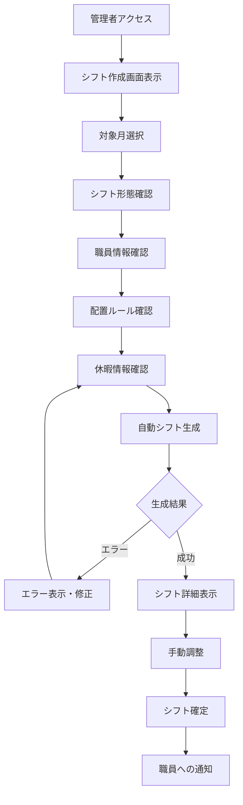

### 3.2 シフト詳細設定フロー

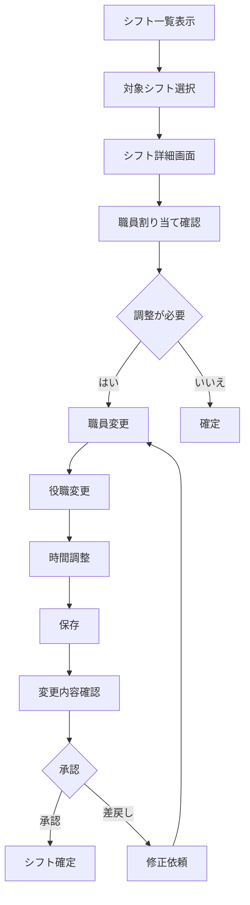

### 3.3 休暇管理フロー

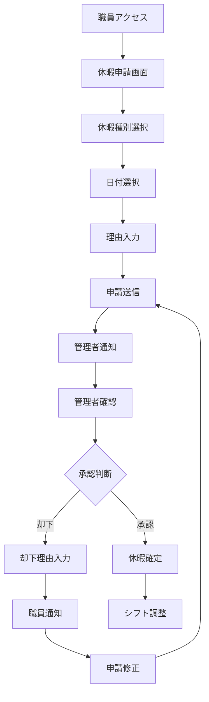

## 👥 4. 役割表管理フロー

### 4.1 役割表作成フロー

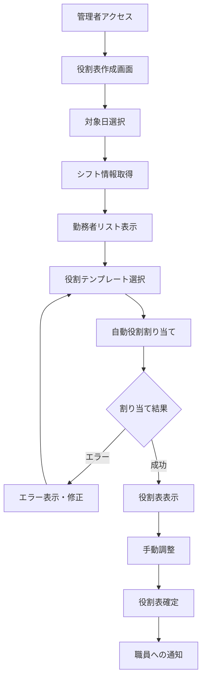

### 4.2 役割割り当て調整フロー

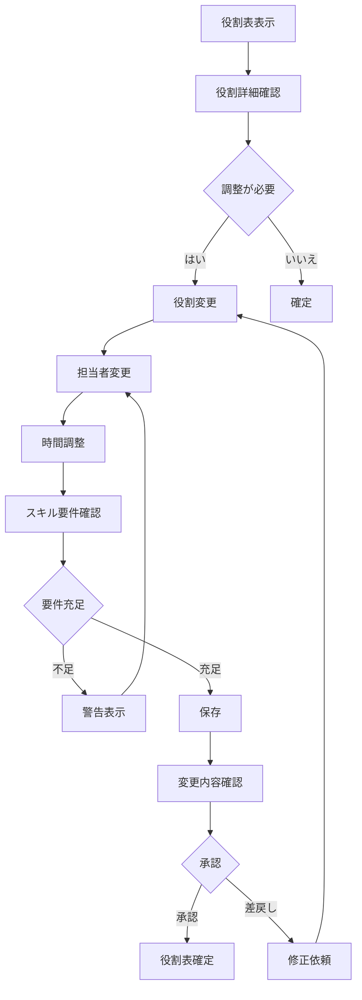

## ⏰ 5. 勤怠管理フロー

### 5.1 出退勤フロー

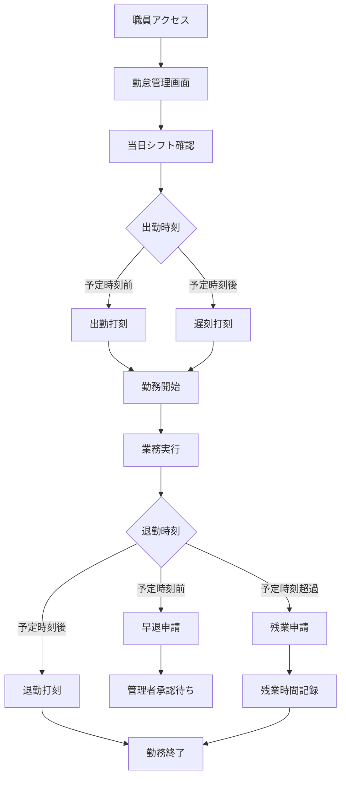

### 5.2 勤怠承認フロー

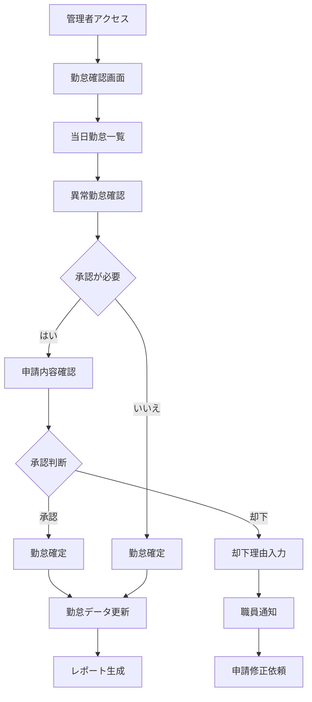

### 5.3 勤怠修正申請フロー

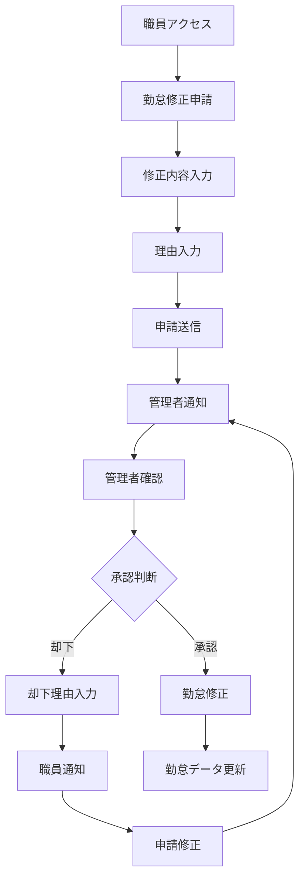

## ⚙️ 6. マスターデータ管理フロー

### 6.1 シフト形態管理フロー

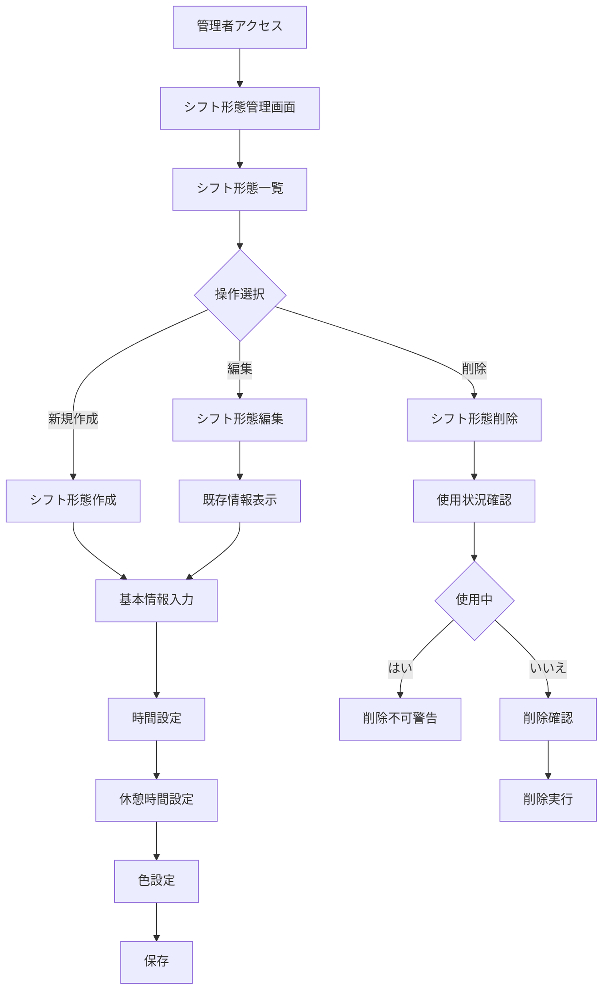

### 6.2 職員管理フロー

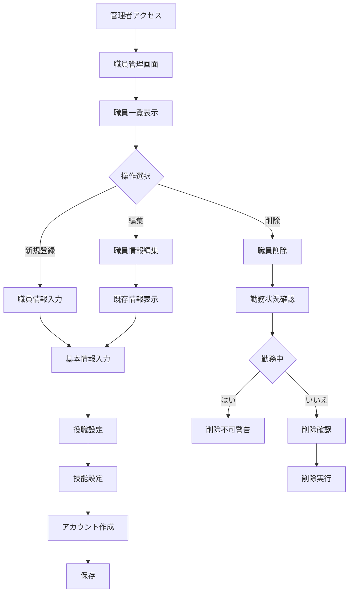

## 🔄 7. データ連携フロー

### 7.1 シフト→役割表連携

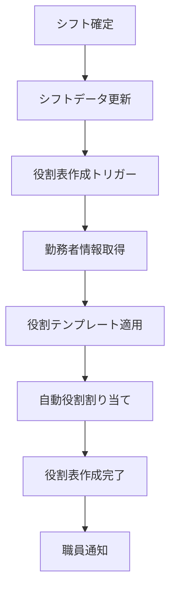

### 7.2 役割表→勤怠連携

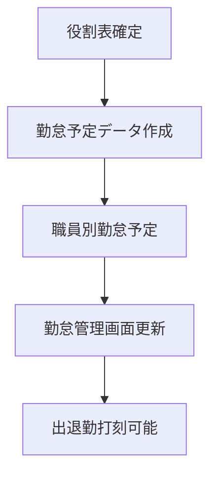

### 7.3 勤怠→レポート連携

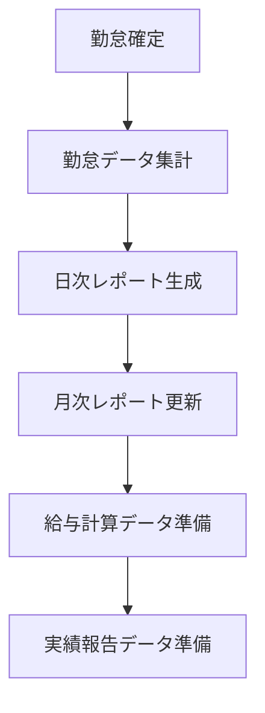

## ⚠️ 8. エラーハンドリングフロー

### 8.1 データ整合性エラー

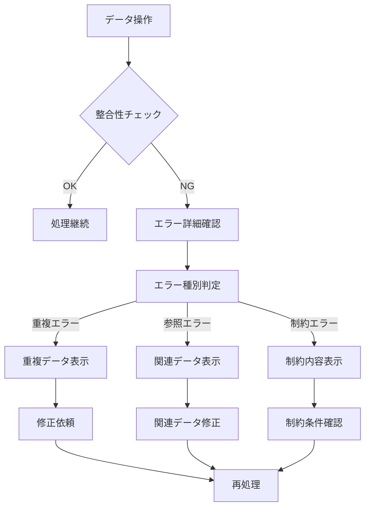

### 8.2 権限エラー

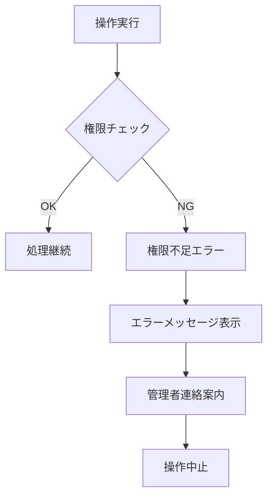

## 📊 9. バッチ処理フロー

### 9.1 日次処理フロー

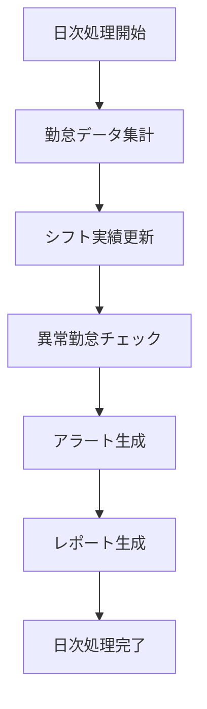

### 9.2 月次処理フロー

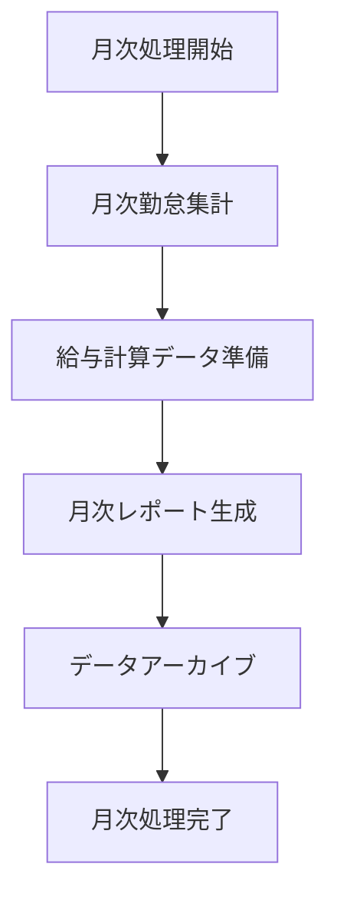

---

**次段階**: [画面設計](./../ui/README.md) に進む
